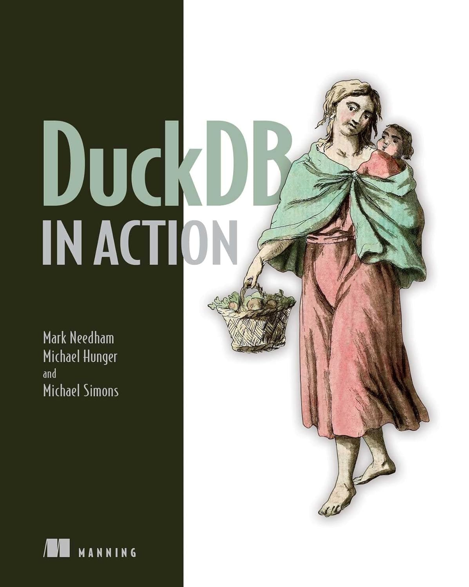

# DuckDB in Action

This is the example repository for the upcoming [Manning](https://www.manning.com) book ["DuckDB in Action"](https://www.manning.com/books/duckdb-in-action) which is currently in Manning Early Access Program (MEAP).

## About the book

DuckDB in Action will show you how to quickly get your hands dirty with [DuckDB](https://duckdb.org). 
You won’t need to read through pages of documentation—you’ll learn as you work. Begin with DuckDB’s CLI embedded mode, then dive straight into modern SQL queries and utilizing DuckDB’s handy SQL extensions.
From there, you’ll explore the different ways you can analyze data with DuckDB, including advanced aggregation and analysis, data without persistence, and DuckDB’s underlying architecture. Learn how to combine DuckDB with the Python ecosystem for even greater customization, and how to extend DuckDB with its own tools. 
You’ll take to DuckDB like a duck to water, rapidly solving almost any relational data task with zero friction.

[MotherDuck](https://motherduck.com) endorses this book, even giving away free copies:

## About the authors

**Mark Needham** is a blogger, and video creator at [@LearnDataWithMark](https://www.youtube.com/channel/UCKEk670ECmteGBehmDjVSSg), where his series on DuckDB offers viewers hands-on insights into practical database applications.

**Michael Hunger** works on the open source [Neo4j graph database](https://neo4j.com) filling many roles, where leads the product innovation and developer product strategy.
Find him as [@mesirii](https://chaos.social/@mesirii) on various channels.

**Michael Simons** is a Java Champion, author, and Staff Software Engineer at Neo4j and has been working professionally as a [developer](https://github.com/michael-simons) for more than 20 years, always close to a database.
Find him as [@rotnroll666](https://mastodon.social/@rotnroll666) on various channels.
